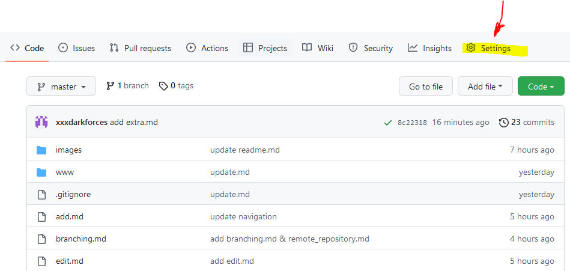
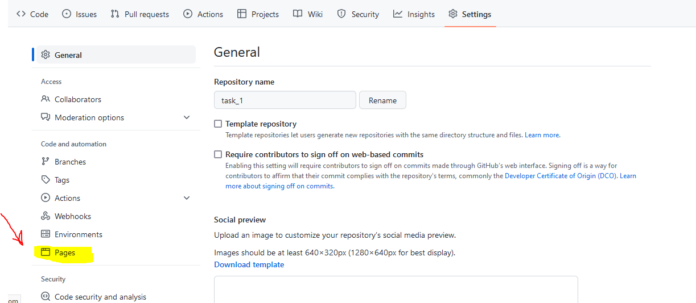
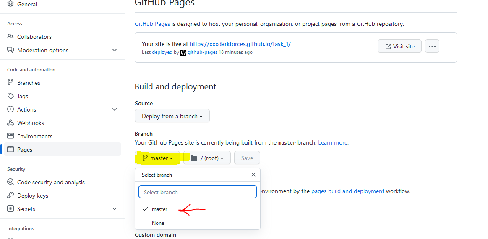
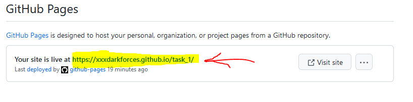

[***> Ветвление***](./branching.md)

[***< Удалённые репозитории***](./remote_repository.md)

[***<< Перейти к содержанию***](./readme.md#содержание)

# Хостинг html страниц на Github

Если ваш сайт — это статические HTML-страницы, то необязательно приобретать хостинг, можно воспользоваться сервисом [GitHub Pages](https://pages.github.com/). Для этого у вас должен быть аккаунт на Гитхабе.

> В какой-то момент, как и все наверное, я решил сделать простой сайт-визитку для себя, с дальнейшим превращением ее в блог и портфолио. Брать какую-то CMS или конструктор не хотелось. Вспомнив, старую статью о [GitHub Pages](https://pages.github.com/), которую я где-то видел, решил погуглить что это такое и с чем едят (***Github*** как бы уже кажется достаточно гиковским). Итого все оказалось довольно просто и я дальше расскажу, как без особо труда и бесплатно можно захостить `html+css+js` страницу на ***Github***.

---

## Как опубликовать сайт на GitHub Pages:

* Чтобы воспользоваться [GitHub Pages](https://pages.github.com/) нам необходимо создать репозиторий и загрузить необходимые файлы. Как это сделать рассказано в предидущей статье [ Удалённые репозитории](./remote_repository.md)

* Перейдите в настройки **Settings** созданного репозитория:

* В настройках репозитория найдите вкладку **Pages**:

* Установите в качестве источника файлов вашей страницы ветку master созданного репозитория:

* Теперь ваш сайт опубликован по адресу вида `https://your-account-name.github.io/repo-name` если файл html лежит в корене репозитория
(у меня html файлы находится в отдельной папке, поэтому сайт доступен по адресу `https://your-account-name.github.io/repo-name/folder-name` )

* Для проверки работы сайта просто перейдите по адресу https://your-account-name.github.io/repo-name – и вы увидите свою страницу, загруженную на [GitHub Pages](https://pages.github.com/) :

---

## Особенности и ограничения

### Сервис Github Pages предоставляет следующие возможности для статических сайтов:

* Использование HTML, CSS, языка разметки Markdown;
* Встраивание изображений и другого медиа;
* Использование JavaScript.

### Ограничения:

* Нельзя использовать на сайте PHP либо другие серверные языки;
* Серверный код и серверные скрипты выполняться не будут;
* Cookies не используются.

---
[***> Ветвление***](./branching.md)

[***< Удалённые репозитории***](./remote_repository.md)

[***<< Перейти к содержанию***](./readme.md#содержание)