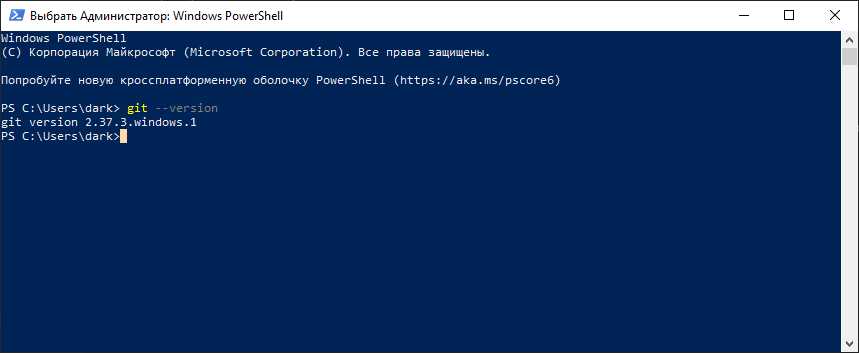

[***Перейти к содержанию***](./readme.md#содержание)


# Установка и настройка Git
Интерфейс для работы с *Git* является консоль/терминал, но можно поставить программу с графическим интерфейсом

---

## Установка Git в Windows


Проверяем наличие установленного *Git*
```
git --version
```

Если *Git* уже установлен, вам отобразится его версия:

Иначе пройдите [*по ссылке на страницу*](https://git-scm.com/download/win) и скачайте необходимый дистрибутив под вашу ОС Windows 32-bit или Windows 64-bit

---

## Установка Git в Linux


Проверяем наличие установленного *GIT*
```
git --version
```
Если *Git* уже установлен, вам отобразится его версия, иначе вводим команду:
```
# Debian или Ubuntu
sudo apt install git
# CentOS
sudo yum install git
```

---

## Установка Git для Mac OS


Открываем терминал и пишем:
```
#Если установлен Homebrew
brew install git

#Если нет, то вводим эту команду. 
git --version
#После этого появится окно, где предложит установить Command Line Tools (CLT).
#Соглашаемся и ждем установки. Вместе с CLT установиться и git
```

---

## Настройка

Итак, мы установили *Git*, теперь нужно добавить немного настроек. Есть довольно много опций, с которыми можно играть, но мы настроим самые важные: наше имя пользователя и адрес электронной почты. Откройте терминал и запустите команды:
```
git config --global user.name "My Name"
git config --global user.email myEmail@example.com
```

Теперь каждое наше действие будет отмечено именем и почтой. Таким образом, пользователи всегда будут в курсе, кто отвечает за какие изменения — это вносит порядок.
*Git* хранит весь пакет конфигураций в файле .gitconfig, находящемся в вашем локальном каталоге. Чтобы сделать эти настройки глобальными, то есть применимыми ко всем проектам, необходимо добавить флаг –global. Если вы этого не сделаете, они будут распространяться только на текущий репозиторий.
Для того, чтобы посмотреть все настройки системы, используйте команду:

```
git config --list
```

Для удобства и легкости зрительного восприятия, некоторые группы команд в *Git* можно выделить цветом, для этого нужно прописать в консоли:

```
git config --global color.ui true
git config --global color.status auto
git config --global color.branch auto
```

Если вы не до конца настроили систему для работы, в начале своего пути - не беда. Git всегда подскажет разработчику, если тот запутался, например:

1. Команда git --help - выводит общую документацию по git
2. Если введем git log --help - он предоставит нам документацию по какой-то определенной команде (в данном случае это - log)
3. Если вы вдруг сделали опечатку - система подскажет вам нужную команду
4. После выполнения любой команды - отчитается о том, что вы натворили
5. Также Гит прогнозирует дальнейшие варианты развития событий и всегда направит разработчика, не знающего, куда двигаться дальше

---

[***Перейти к содержанию***](./readme.md#содержание)