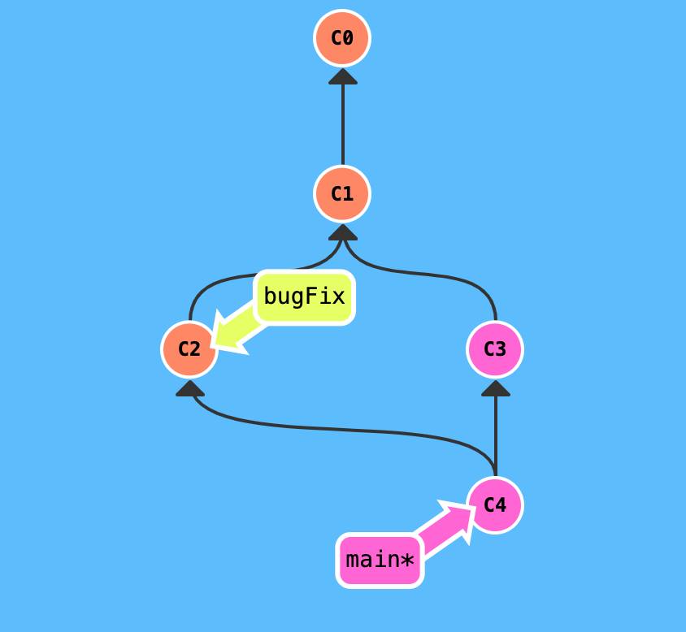

# **Практическая работа:** инструкция по работе с *Git*
LICENSE: [GNU General Public License v2](./license.md)

---
## Содержание
1. [Основы *Git*](#основы-git)
2. [Установка](./install.md)
    * [Установка для Windows](/install.md#установка-git-в-windows)
    * [Установка в Linux](/install.md#установка-git-в-linux)
    * [Установка для Mac OS](/install.md#установка-git-для-mac-os)
    * [Настройка *Git*](/install.md#настройка-git)
3. [Создание нового репозитория](./repository.md)
4. [Добавление файлов](./add.md)
5. [Фиксация изменений](./edit.md)
    * [Как сделать коммит](./edit.md#как-сделать-коммит)
    * [Как посмотреть коммиты](./edit.md#как-посмотреть-коммиты)
6. [Удалённые репозитории](./remote_repository.md)
    * [Что такое удаленный репозиторий](./remote_repository.md#что-такое-удаленный-репозиторий)
    * [Подключение к удаленному репозиторию](./remote_repository.md#подключение-к-удаленному-репозиторию)
    * [Отправка изменений на сервер](./remote_repository.md#отправка-изменений-на-сервер)
    * [Запрос изменений с сервера](./remote_repository.md#запрос-изменений-с-сервера)
7. [Ветвление](./branching.md)
    * [Создание новой ветки](./branching.md#создание-новой-ветки)
    * [Переключение между ветками](./branching.md#переключение-между-ветками)
    * [Слияние веток](./branching.md#слияние-веток)
    * [Как удалять ветки в Git](./branching.md#как-удалять-ветки-в-git)
8. [Настройка .gitignore](./ignore.md)

---

## Основы Git

### **Что такое Git и зачем он нужен?**

*Git* - это консольная утилита, для отслеживания и ведения истории изменения файлов, в вашем проекте. Чаще всего его используют для кода, но можно и для других файлов. Например, для картинок - полезно для дизайнеров.

С помощью Git-a вы можете откатить свой проект до более старой версии, сравнивать, анализировать или сливать свои изменения в репозиторий.

Репозиторием называют хранилище вашего кода и историю его изменений. Git работает локально и все ваши репозитории хранятся в определенных папках на жестком диске.

Так же ваши репозитории можно хранить и в интернете. Обычно для этого используют три сервиса:
* [GitHub](https://github.com/)
* [Bitbucket](https://bitbucket.org/)
* [GitLab](https://gitlab.com/)

Каждая точка сохранения вашего проекта носит название коммит (commit). У каждого commit-a есть hash (уникальный id) и комментарий. Из таких commit-ов собирается ветка. Ветка - это история изменений. У каждой ветки есть свое название. Репозиторий может содержать в себе несколько веток, которые создаются из других веток или вливаются в них. 

### **Как работает**

Если посмотреть на картинку, то становиться чуть проще с пониманием. Каждый кружок, это commit. Стрелочки показывают направление, из какого commit сделан следующий. Например C3 сделан из С2 и т. д. Все эти commit находятся в ветке под названием main. Это основная ветка, чаще всего ее называют master . Прямоугольник main* показывает в каком commit мы сейчас находимся, проще говоря указатель.

В итоге получается очень простой граф, состоящий из одной ветки (main) и четырех commit. Все это может превратиться в более сложный граф, состоящий из нескольких веток, которые сливаются в одну.

[***Перейти к содержанию***](#содержание)

---
Git Logo by [Jason Long](https://twitter.com/jasonlong) is licensed under the [Creative Commons Attribution 3.0 Unported License.](https://creativecommons.org/licenses/by/3.0/)